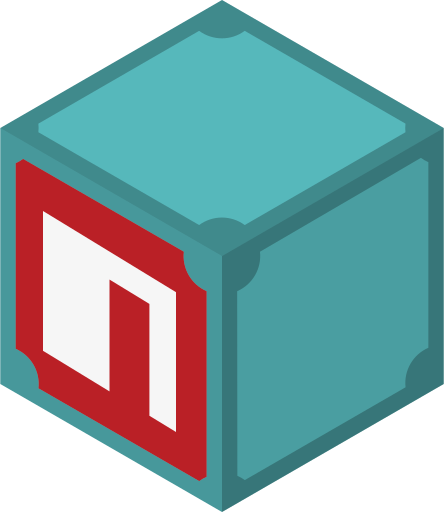

npm on IPFS
===========



[](https://protocol.ai)
[](http://ipfs.io/)
[](http://webchat.freenode.net/?channels=%23ipfs)
[](https://ci.ipfs.team/job/IPFS%20Shipyard/job/npm-on-ipfs/job/master/)
[](https://codecov.io/gh/ipfs-shipyard/npm-on-ipfs)
[](https://david-dm.org/ipfs-shipyard/npm-on-ipfs)

> Install your favourite modules from the Distributed Web using IPFS. Have a cache always ready and share them in all your local networks.

# Usage

Use the `ipfs-npm` command to start a local IPFS node instead of using the http gateway:

```console
$ npm install -g ipfs-npm
$ cd /to/project/dir
$ ipfs-npm
```

You can configure it to connect to an existing IPFS node, or perhaps use `yarn` instead of `npm` - see the [README](./packages/ipfs-npm/README.md) for more.

## npm registry mirror

You can also use our `npm` -> `ipfs` -> `http` gateway:

```console
$ npm install --registry=https://registry.js.ipfs.io
```

or for all your requests (non-get requests will be proxied to the main `npm` registry):

```console
$ npm config set registry https://registry.js.ipfs.io
$ npm install
```

## Run your own gateway:

What if you want to run your own `npm` -> `ipfs` -> `http` gateway?

```console
# with docker installed
$ git clone https://github.com/ipfs-shipyard/npm-on-ipfs.git
$ cd npm-on-ipfs
$ ./deploy.sh
```

See the [replication-master](./packages/replication-master/README.md) and [registry-mirror](./packages/registry-mirror/README.md) READMEs for more.

# Resources

- [The original demo video](https://vimeo.com/147968322)
- [Lengthy introduction in a blog post](http://daviddias.me/blog/stellar-module-management/)
- [Node.js Interactive Talk - Stellar Module Management](https://www.youtube.com/watch?v=-S-Tc7Gl8FM)

## Lead Maintainer

[Alex Potsides](https://github.com/achingbrain)

# Acknowledgements

This module takes a lot of inspiration from [reginabox](https://www.npmjs.com/package/reginabox). Big thank you to everyone that contributed with code or to the [discussion](https://github.com/ipfs/notes/issues/2) to make this happen.
